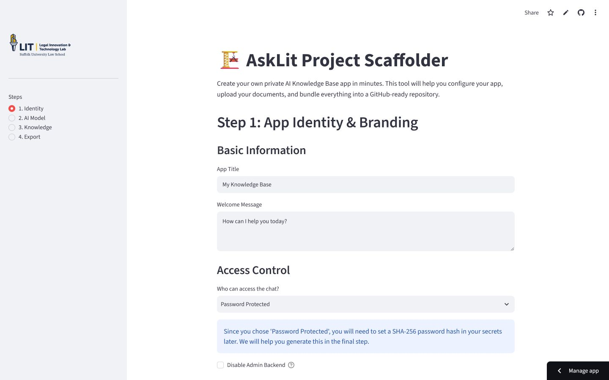
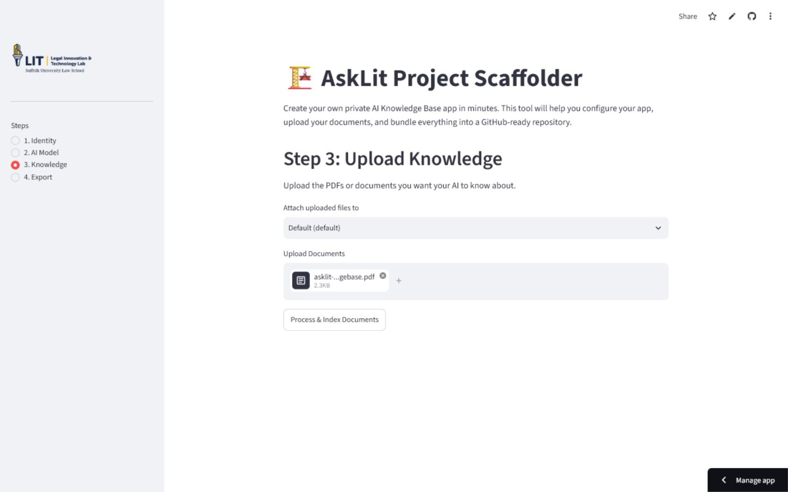
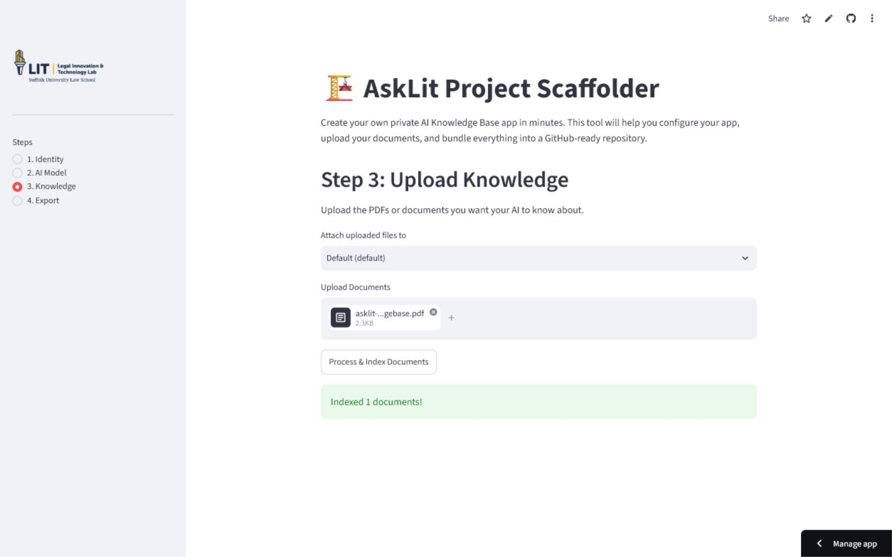
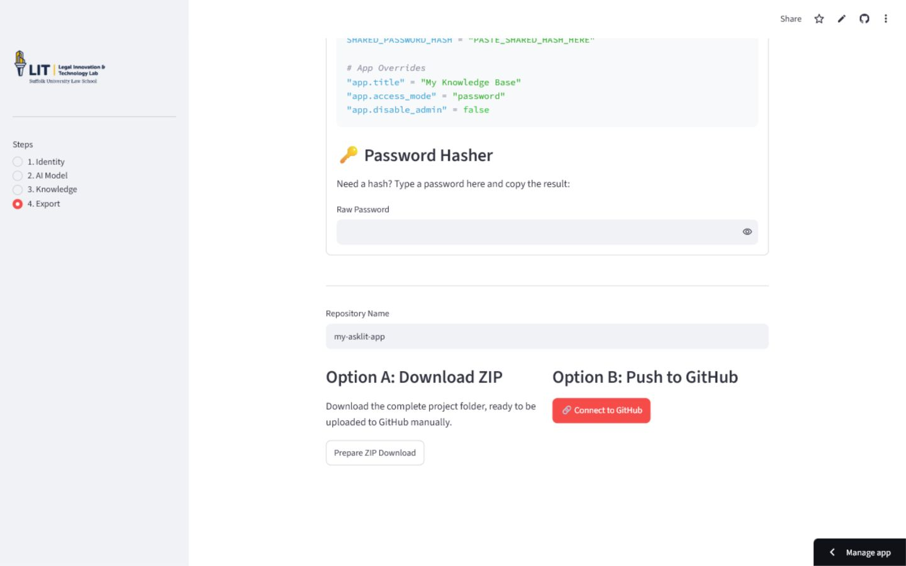
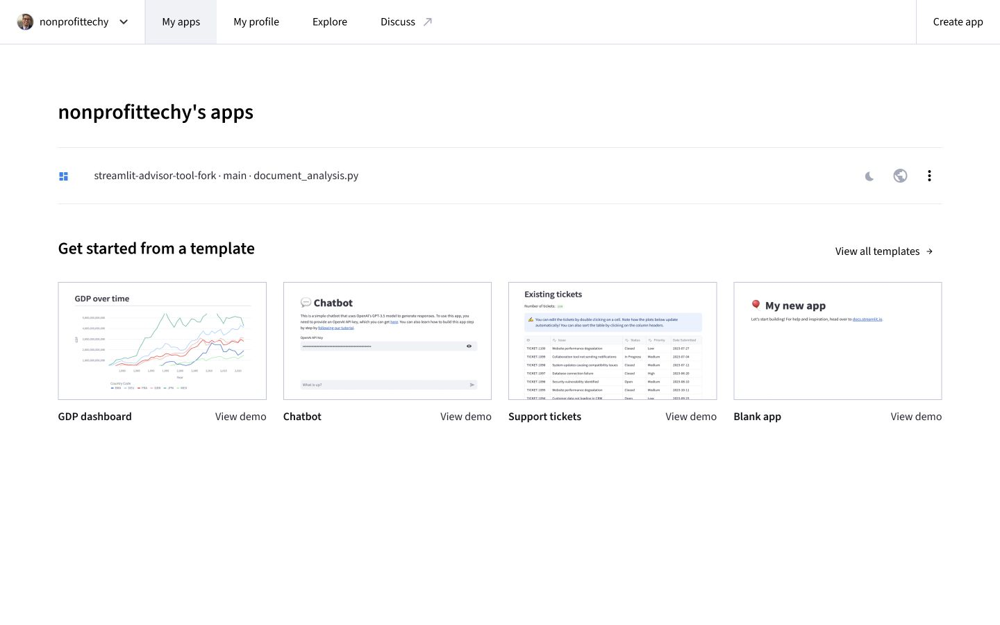
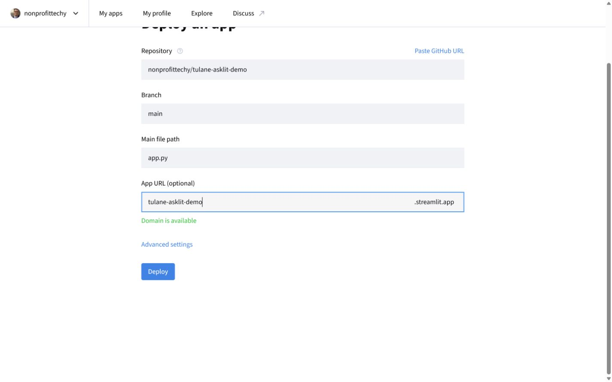
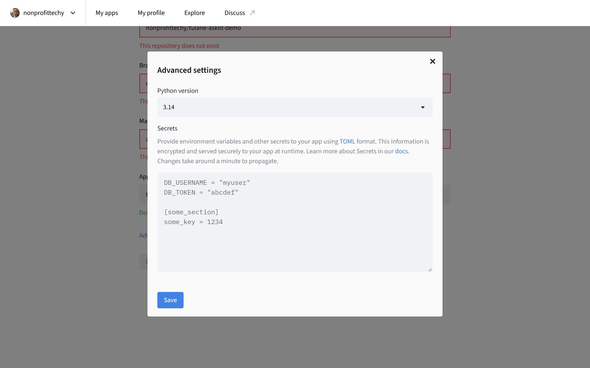
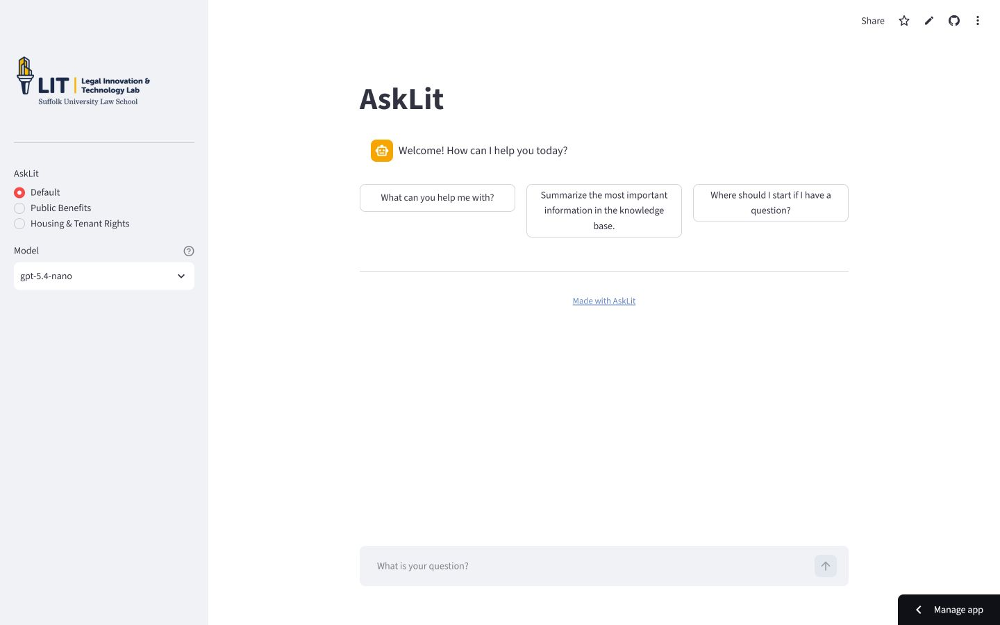

# Deploy an AskLit app with GitHub and Streamlit

This guide is for people who do not code. You will use the AskLit Scaffolder to make the project, GitHub to hold it, and Streamlit Community Cloud to put it on the web.

The completed demonstration is available at <https://tulane-asklit-demo.streamlit.app/>. Its example repository is public at <https://github.com/nonprofittechy/tulane-asklit-demo>.

> **Keep secrets secret.** Never upload or commit a real `.streamlit/secrets.toml` file to GitHub. The examples below are placeholders. Paste your real values only into Streamlit's private **Secrets** box.

## What you need

- An email address you can open now.
- A free GitHub account: <https://github.com/signup>
- A free Streamlit Community Cloud account: <https://share.streamlit.io/>
- Your organization's AskLit secrets file, supplied separately by the program administrator.
- One or more knowledge-base files in PDF, DOCX, TXT, or Markdown format.

If you only want to practice, download the fictional [AskLit sample knowledge base](asklit-sample-knowledgebase.pdf). It contains no real client or secret information.

For the easiest free deployment, make the generated GitHub repository **public**. Streamlit can work with private repositories when the relevant GitHub permissions and account features are available, but a public repository avoids that extra permission setup. Public repositories must never contain passwords, API keys, confidential documents, or a real `secrets.toml`.

## Before using the scaffolder: plan what the assistant should know and do

AskLit combines two different ingredients:

- The **system prompt** tells the assistant how to behave: its role, boundaries, tone, and what to do when the documents do not contain an answer.
- The **knowledge base** supplies the facts it may use: policies, handbooks, instructions, FAQs, forms, and other source material.

The prompt is not a substitute for source material. For example, writing “Know all Tulane policies” in the prompt does not give the assistant those policies. The relevant policy documents must be uploaded to the knowledge base.

### Write a useful system prompt

A good system prompt answers these questions in ordinary language:

1. **Who is the assistant helping?** Name the audience and the assistant's role.
2. **What subjects are in scope?** Be specific about what it should and should not answer.
3. **What sources may it trust?** Tell it to base factual answers on the supplied context.
4. **What if the answer is missing?** Require it to say that the documents do not answer the question instead of guessing.
5. **How should it communicate?** Specify tone, reading level, length, formatting, or important definitions.
6. **What safety boundary matters?** For legal, medical, benefits, or other high-stakes subjects, explain that it provides information rather than professional advice and direct users to the appropriate human office when needed.

Here is a reusable example:

```text
You are a friendly program-information assistant for participants in the
Tulane educator cohort. Answer questions about the cohort schedule,
assignments, attendance rules, and support contacts.

Base factual answers on the provided knowledge-base context. Do not invent
dates, requirements, links, or contact information. If the context does not
contain the answer, say that clearly and suggest contacting the program
coordinator.

Use plain language and short paragraphs. When explaining a process, use a
numbered list. Mention the source document or section when that information
is available. Do not provide legal, medical, or financial advice.
```

Avoid prompts such as “You are helpful” with no further direction. Also avoid putting API keys, passwords, private contact details, or long copies of policies in the prompt.

### Create helpful conversation starters

Conversation starters are example questions displayed as buttons. They show visitors what the assistant is for. Use real questions your audience is likely to ask, such as:

- “What do I need to complete before the first session?”
- “What is the attendance policy?”
- “Who should I contact if I need help with an assignment?”

Each starter should be answerable from the uploaded documents. Three to five starters is usually enough.

### Prepare good knowledge-base files

Use documents that contain the answers you want AskLit to give. Good examples include a current participant handbook, program calendar, approved FAQ, step-by-step procedure, resource directory, or policy manual.

Before uploading a PDF or DOCX file:

- **Check permission and privacy.** Remove student records, client information, passwords, secret links, and anything that should not be published. This is essential for a public GitHub repository.
- **Use the current approved version.** Put a title, owner, and “last updated” date near the beginning. Remove obsolete drafts when possible.
- **Make the text readable by software.** A normal Word document or text-based PDF works best. A scanned PDF is only a picture until it has optical character recognition (OCR); test that you can select and copy its words.
- **Use descriptive headings.** Headings such as “Attendance,” “Deadlines,” and “Contacting Support” help retrieval more than one long block of text.
- **State facts directly.** Include full dates, eligibility conditions, exceptions, contact information, and the steps in a process. Explain acronyms the first time they appear.
- **Resolve contradictions.** If two documents give different deadlines or rules, fix or remove the older one before upload. AskLit cannot reliably decide which conflicting source is authoritative.
- **Keep related material together.** One well-organized handbook can work well; several clearly named files are also fine. Avoid hundreds of nearly identical versions.
- **Remember that uploaded content is a snapshot.** A link in a document does not automatically import or continuously update the linked webpage. Upload revised source files when policies change.

After indexing, test at least five questions: an easy fact, a multi-step process, an exception, a question using different wording from the document, and one question the documents do **not** answer. The last test should produce an honest “I don't know” response rather than a guess.

### When to make more than one prompt and knowledge base

Create separate prompt pairings when visitors need clearly different assistants or source collections—for example, “Course Logistics” and “Student Services.” Give each pairing a short **Navigation Label**, a unique **Knowledge Base Name**, its own system prompt, and the relevant uploaded files. If everything serves the same audience and purpose, start with one pairing; it is easier to test and maintain.

## Part 1: Create and protect your accounts

1. Go to <https://github.com/signup> and create an account.
2. Open the verification message GitHub sends to your email address.
3. In GitHub, open your profile picture, choose **Settings**, then **Password and authentication**.
4. Turn on two-factor authentication and save the recovery codes somewhere safe.
5. Go to <https://share.streamlit.io/> and choose **Continue with GitHub**. Approve the connection.

You do **not** need to create a GitHub personal access token. The centralized AskLit Scaffolder handles the GitHub connection.

## Part 2: Build the project in the AskLit Scaffolder

Open <https://asklit-scaffold.streamlit.app/> in a wide browser window. If the left sidebar covers the form, click its collapse arrow or maximize the browser.

### 1. Name and describe the app

Enter the public-facing title, welcome message, and organization details. If the
chat is password protected, enter and confirm its password on this screen.
AskLit immediately replaces the plain password with a PBKDF2 hash and inserts
that hash into the deployment settings later. Configure the administrator
password here as well when the admin backend is enabled. Do not enter API keys;
those belong only in the deployed app's private Streamlit Secrets.



### 2. Choose the administrator-provided model settings

Choose the model provider and model specified by your program administrator. For a Tulane cohort deployment, use the values supplied with the Tulane configuration rather than guessing.

When using **OpenAI** with a proxy, Azure OpenAI-compatible URL, or another
compatible service, select **Use a custom OpenAI-compatible endpoint** and enter
its base URL, including a path such as `/v1` when required. Enter the model name
accepted by that service. The scaffolder exports the URL but never its own API
key; add your provider key later in Streamlit's private Secrets settings.

For **Azure APIM**, the current workshop gateway URL is prefilled. You may
replace it with another OpenAI-compatible APIM gateway URL. The exported app
receives the selected URL, never the scaffolder's gateway key.

### 3. Upload a PDF or Word knowledge base

Open **Knowledge Base**, click **Browse files**, and choose one or more PDF or DOCX files. You can also drag files onto the upload area.

The filename appears after the upload finishes.



Click the button to process or index the files. Wait for the success message before moving on. Indexing is what makes the documents searchable by AskLit.



Only upload documents you are allowed to publish. If a generated repository will be public, assume its bundled knowledge-base material will also be public.

### 4. Optionally compare configurations in the Experiment Lab

Open **Experiment Lab** to test one question against different prompts, knowledge bases, and models before exporting. Each combination makes a real model request, so select only the combinations you need. Compare the answers and retrieved sources, then return to earlier steps to adjust your configuration if needed. Experiment results are temporary and are not added to the generated repository.

### 5. Export to GitHub

Open **Export & Deploy**. Review the checklist, connect GitHub when prompted,
and choose a short repository name such as `my-asklit-app`. AskLit displays a
one-time code: open the GitHub authorization page, enter that code, approve the
connection, and return to the still-open AskLit tab. The scaffolder should
create and populate the repository; the end user should not need to create or
paste a GitHub token.



The scaffolder creates a **public** repository by default for the simplest
Streamlit Community Cloud deployment. Before publishing, confirm there is no
real `.streamlit/secrets.toml` and no confidential source document in the
project. Select **Make the GitHub repository private** before publishing only if
your Streamlit account can deploy private repositories.

## Part 3: Deploy on Streamlit Community Cloud

### 1. Start a deployment

Open <https://share.streamlit.io/>, sign in with GitHub, and click **Create app** or **Deploy an app**.



Fill in:

- **Repository:** your GitHub username and repository, for example `your-name/my-asklit-app`
- **Branch:** `main`
- **Main file path:** `app.py`
- **App URL:** an available short name of your choice

Select the matching repository or branch from the suggestion list if Streamlit shows one. If Streamlit says the repository does not exist immediately after it was created or made public, refresh the page and select it again.



### 2. Add the real secrets privately

Click **Advanced settings**. Select the Python version already recommended by the project, then paste the complete contents of the Tulane `secrets.toml` supplied to you into the **Secrets** box.



The real file will contain values specific to your cohort. A safe placeholder example looks like this:

```toml
AZURE_APIM_API_KEY = "PASTE-THE-KEY-PROVIDED-TO-YOU"
AZURE_APIM_BASE_URL = "https://example-gateway.azure-api.net/asklit"

"model.provider" = "azure_apim"
"model.name" = "MODEL-NAME-PROVIDED-TO-YOU"
"app.title" = "My AskLit"
"app.access_mode" = "public"
```

Do not copy the placeholder values above into a real deployment. Use every setting in the file your administrator supplied. Click **Save**.

### 3. Deploy and verify

Click **Deploy**. The first build may take several minutes while Streamlit installs the project. When it finishes, AskLit should display a welcome message, model selector, knowledge-base choices, and a question box.



Ask one question that can be answered from your uploaded PDF or Word document. Check that the answer is grounded in that document before sharing the app URL.

## Troubleshooting

- **The Streamlit sidebar covers the form:** maximize the browser or collapse the sidebar with its arrow.
- **Streamlit cannot find the repository:** confirm the spelling, select the repository from the dropdown, refresh after changing its visibility, and confirm Streamlit is connected to the correct GitHub account.
- **GitHub authorization is temporarily unavailable:** a brand-new GitHub OAuth application can be held briefly by GitHub's anti-abuse controls. Try again later; do not ask educators to make personal access tokens.
- **The app stays “in the oven”:** open **Manage app** to see the build logs. Dependency installation on the first launch can take a few minutes.
- **The app opens but cannot answer:** recheck the Streamlit Secrets box and verify the knowledge base finished indexing before export.
- **A secret was committed accidentally:** treat it as exposed, revoke or rotate it immediately, remove it from Git history, and redeploy with the replacement in Streamlit Secrets.

## Who owns what

- The central `nonprofittechy` account owns and maintains the AskLit Scaffolder and its GitHub OAuth connection.
- The educator's GitHub account owns the generated AskLit repository.
- The educator's Streamlit account owns the deployed app and its private secrets.

That separation lets educators use the no-code workflow without receiving the scaffolder's central GitHub credentials.

## Scaffolder operator: GitHub OAuth setup

The central scaffolder uses GitHub's OAuth device flow so an authorization does
not navigate away from and erase an in-progress Streamlit session.

1. In GitHub, open **Settings → Developer settings → OAuth Apps** and register
   an OAuth app owned by the central account or organization.
2. Use `https://asklit-scaffold-lab.fly.dev/` for both the homepage and
   authorization callback URL.
3. Open the OAuth app's settings and enable **Device Flow**.
4. Store only its public client ID in the deployment:

   ```bash
   flyctl secrets set GITHUB_CLIENT_ID=<client-id> --app asklit-scaffold-lab
   ```

AskLit requests the classic `repo` scope so the educator can optionally select a
private repository. Repositories are public by default. AskLit does not deploy
or require the OAuth client secret.
